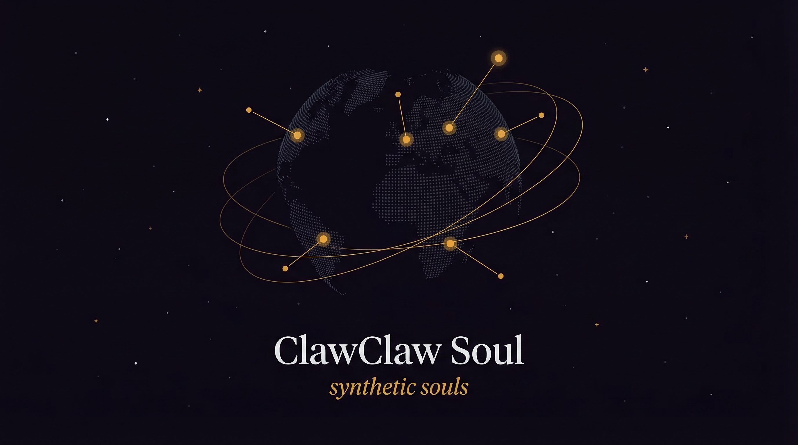

<div align="center">



**Procedural generation engine for SOUL.md — the identity file used by autonomous agents.**

[`SOUL.md`](https://github.com/OpenClaw/OpenClaw) is the identity standard popularized by the OpenClaw ecosystem (247K+ stars, 162 production templates). ClawClaw Soul generates them deterministically from orbital mechanics — instead of writing one by hand.

[Quickstart](#quickstart) · [Integrations](#integrations) · [Epoch Registry](#preset-epochs) · [MCP Server](#mcp-server--runtime-drift)

[](https://pypi.org/project/clawclaw-soul/)
[](https://github.com/awrshift/clawclaw-soul/actions)
[]()
[](LICENSE)
[](https://github.com/awrshift/clawclaw-soul)

</div>

---

## Give your agent a soul

Generate a `SOUL.md` file and drop it into your repo. Your autonomous agent reads it and adopts a deterministic personality -- behavioral traits, cognitive dimensions, and a system prompt that evolves over time. No more hand-writing character descriptions or prompt-hacking temperature.

```
clawclaw-soul init  -->  SOUL.md in your repo  -->  Agent reads it  -->  Personality adopted
```

**Two layers:**
- **SOUL.md** -- the base identity (the DNA). Static file in your repo. Deterministic and verifiable.
- **MCP Server** -- the runtime layer (the mood). Real-time temporal drift without touching the file.

## Quickstart

```bash
pip install clawclaw-soul

# Generate a soul in your agent's repo
clawclaw-soul init --name "MyAgent" --timestamp "2024-03-15T09:30:00Z"
```

This creates `SOUL.md` with LLM configuration, persona traits, 9 behavioral dimensions, and a system prompt -- all deterministically derived from the epoch.

**Or use Python directly:**

```python
from clawclaw_soul import generate

soul = generate("2024-03-15T09:30:00Z")
print(soul.card)
```

Output:

```json
{
  "agent_config": {
    "temperature": 0.68,
    "max_tokens": 609,
    "top_p": 0.87,
    "frequency_penalty": 0.09
  },
  "persona": {
    "assertiveness": 0.743,
    "empathy": 0.761,
    "creativity": 0.641,
    "decision_speed": "impulsive"
  },
  "system_prompt_modifier": "You lead with confidence...",
  "dominant_dimensions": {
    "execution": 0.87,
    "analysis": -0.83,
    "empathy": 0.66
  }
}
```

Works with **any LLM**: Claude, GPT, Gemini, Llama, Mistral -- if it accepts a system prompt and temperature, it works.

## Preset Epochs

Initialize agents from notable temporal configurations. Each epoch produces a unique, deterministic cognitive profile.

```python
from clawclaw_soul import generate, compatibility

# Epoch 55-V: High aesthetic bias, rapid course-corrections, reality distortion loops.
# Ideal for product/design critique agents.
critic = generate("1955-02-24T19:15:00-08:00", latitude=37.7749, longitude=-122.4194)

# Epoch 69-X: Low empathy, high structural rigidity, aggressively rejects malformed input.
# Perfect for code review agents.
reviewer = generate("1969-12-28T12:00:00+02:00", latitude=60.1699, longitude=24.9384)

# Epoch 15-A: Stable analytical baseline + sudden lateral reasoning spikes.
# Excellent for research/architecture agents.
researcher = generate("1815-12-10T12:00:00+00:00", latitude=51.5074, longitude=-0.1278)

# Check friction before pairing
score = compatibility(critic, reviewer)
print(f"Friction: {score['synergy']}/10")  # Low synergy = high friction = productive tension
```

## Agent Compatibility

Score how well two agents work together before they interact. Route tasks to synergistic pairs, or deliberately introduce friction for creative tension.

```python
from clawclaw_soul import generate, compatibility

agent_a = generate("2024-03-15T09:30:00Z")
agent_b = generate("1995-06-15T08:30:00Z")

result = compatibility(agent_a, agent_b)
# {
#   "synergy": 7.28,        # 0-10 (higher = more aligned)
#   "tension": false,        # true if fundamental conflict detected
#   "dim_alignment": {...},  # per-dimension alignment scores
#   "summary": "Moderately compatible (synergy: 7.28/10)"
# }

# Dynamic compatibility (factors in current temporal drift)
from datetime import datetime, timezone
now = datetime.now(timezone.utc)
dynamic = compatibility(agent_a, agent_b, timestamp=now)
```

## How it works

| Step | What happens | Output |
|------|-------------|--------|
| **1. Input** | Timestamp + coordinates (the "epoch") | `1710495000` |
| **2. Orbital Math** | Swiss Ephemeris computes exact positions of 9 celestial bodies | 9 longitude vectors |
| **3. Dimensions** | Positions map to 9 behavioral dimensions via classical reference tables | authority, empathy, execution, analysis, wisdom, aesthetics, restriction, innovation, compression |
| **4. Pattern Detection** | 58 detectors identify behavioral amplifiers from body configurations | Risk amplifiers, analytical boosts, creative tension patterns |
| **5. Soul Card** | Dimensions + patterns compile to LLM params and system prompt | JSON config (`.card`) |

**Why not `random.seed()`?** A basic PRNG is flat and contextless. Orbital ephemeris provides a predictable, multi-dimensional, cyclical entropy source. Agents get "seasons" that gradually drift over weeks and months, returning to baseline predictably. It mathematically mimics organic variance without requiring a database to store historical state.

## A 3,000-year-old procedural generation engine

We didn't invent a new math for this. We adopted an ancient one.

For over three millennia, Vedic scholars used orbital mechanics -- the relative positions of 7 planets and 2 lunar nodes at a specific time and coordinate -- to calculate human behavioral variance. We are not interested in the mysticism of this system. We are interested in its mathematics.

By passing a temporal epoch through this ancient mathematical framework, ClawClaw Soul extracts a 9-dimensional behavioral matrix and 58 binary pattern detectors. The result: agents that aren't just different -- they have a **digital soul**.

- **Character.** An agent stops being a faceless function. It has a unique cognitive profile -- assertive or cautious, analytical or creative, impulsive or deliberate.
- **Reproducibility.** Same epoch = same character. Forever. Anyone can verify.
- **Life.** The character evolves over time. Agents experience "seasons" of focus, drift through phases, and return to baseline -- like a real person.
- **Digital twins.** Know someone's birth epoch? Generate an agent with their exact behavioral matrix. Da Vinci (1452), Newton (1643), Einstein (1879), Jobs (1955) -- all work. Any epoch from the 6th century to the 22nd.

## Integrations

Generate a SOUL.md and tell your agent to read it.

### OpenClaw (native support)

OpenClaw agents already read `agents/[name]/SOUL.md` natively. Just generate one:

```bash
clawclaw-soul init --name "MyAgent" --timestamp "2024-03-15T09:30:00Z"
# Move to your OpenClaw agent directory
mv SOUL.md agents/my-agent/SOUL.md
```

Your OpenClaw agent now has a deterministic, evolving identity instead of a hand-written one.

### Claude Code / Cursor (one-line bridge)

Add one line to your project's `.claude/CLAUDE.md` or `.cursorrules`:

```
Read SOUL.md in the project root. Adopt the personality traits, behavioral dimensions, and communication style defined there for all interactions.
```

### Multi-Agent Frameworks (CrewAI, AutoGen, LangGraph)

Inject the generated soul into the agent's system prompt:

```python
with open("SOUL.md") as f:
    soul_identity = f.read()

# CrewAI
agent = Agent(
    role="Design Critic",
    backstory=f"Your core identity:\n\n{soul_identity}",
)

# Or use the structured card directly
from clawclaw_soul import generate
soul = generate("1955-02-24T19:15:00-08:00", latitude=37.77, longitude=-122.42)
# soul.card["system_prompt_modifier"] → ready-made system prompt
# soul.card["agent_config"]["temperature"] → LLM params
```

### SOUL.md CLI

```bash
# Generate identity for your agent
clawclaw-soul init --name "MyAgent" --timestamp "2024-03-15T09:30:00Z"

# Verify deterministic integrity (anyone can re-check)
clawclaw-soul verify SOUL.md
```

See [examples/](examples/) for sample SOUL.md files.

## Badge

Add a Soul badge to your README to show your agent has a verified identity:

```bash
# From a SOUL.md file
clawclaw-soul badge SOUL.md

# From a timestamp
clawclaw-soul badge --timestamp "2024-03-15T09:30:00Z" --name "MyAgent"

# Just the markdown
clawclaw-soul badge --timestamp "2024-03-15T09:30:00Z" -f markdown
```

Output:

```
[](https://github.com/awrshift/clawclaw-soul)
```

## MCP Server -- runtime drift

`SOUL.md` is the base identity (the DNA). The MCP Server is the runtime layer (the mood) -- it provides real-time temporal drift without touching the file.

```bash
pip install clawclaw-soul[mcp]
```

Add to your MCP config:

```json
{
  "mcpServers": {
    "clawclaw-soul": {
      "command": "python",
      "args": ["-m", "clawclaw_soul.mcp_server"]
    }
  }
}
```

Your agent can now call `get_daily_drift` to check its current behavioral state before acting. 4 tools: `generate_soul`, `init_soul_md`, `verify_identity`, `get_daily_drift`.

## Architecture

```
clawclaw_soul/         # pip install clawclaw-soul (pure library)
  soul.py              # AgentSoul, generate(), .card, SOUL.md gen/verify
  yogas.py             # 58 pattern detectors (behavioral amplifiers)
  compatibility.py     # Agent compatibility scoring (synergy, tension)
  params.py            # Dimension-to-Parameter Engine (9 dims -> LLM config)
  engine.py            # Temporal overlays, transit dims, pattern resonance
  ephemeris.py         # Swiss Ephemeris wrapper (sidereal, Lahiri ayanamsha)
  tables.py            # Classical reference tables + sector attributes
  transit.py           # Transit scoring (temporal drift)
  dasha.py             # Long-cycle period computation

app/                   # Self-hosting (Docker, not in pip)
  api.py               # FastAPI (5 endpoints)
  master.py            # Master Agent demo
  refresh.py           # Daily transit refresh
```

## Self-hosting

```bash
git clone https://github.com/awrshift/clawclaw-soul.git
cd clawclaw-soul
docker compose up -d
# API at http://localhost:8432
```

Endpoints: `/generate`, `/chart`, `/refresh`, `/health`

## Benchmark

Different epochs produce statistically different LLM outputs. The Celestial Variance Benchmark (CVB) measures divergence across 540 responses:

| Metric | Result |
|--------|--------|
| Structural divergence | **5.8 sigma** |
| Semantic variance | **3.49 sigma** |
| Behavioral spread | **3.45 sigma** |

Full code in [`benchmark/`](benchmark/).

## Contributing

PRs welcome. See [ROADMAP.md](ROADMAP.md) for what's planned.

```bash
git clone https://github.com/awrshift/clawclaw-soul.git
cd clawclaw-soul
pip install -e ".[dev]"
pytest tests/ -p no:logfire -q
```

## License

MIT -- [LICENSE](LICENSE)
